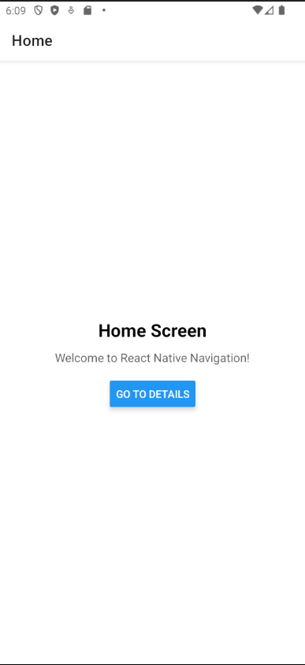

# React Native Navigation Lab Activity

A React Native application demonstrating stack navigation using React Navigation and Expo.

## Student Information

- **Name:** Ray Cielo Briones
- **Student ID:** 202304342
- **Course:** Mobile Application Development
- **Date:** December 2, 2025

## Features

- Stack navigation between screens
- Home and Details screens
- Navigation buttons and gestures
- Android emulator support

## Technologies Used

- React Native 0.76.3
- Expo ~52.0.0
- React Navigation 6.x
- JavaScript/ES6

## Installation

\`\`\`bash
npm install
\`\`\`

## Running the App

\`\`\`bash

# Start development server

npm start

# Run on Android

npm run android

# Run on iOS

npm run ios

# Run on web

npm run web
\`\`\`

## Project Structure

\`\`\`
├── App.js # Main app with navigation
├── screens/
│ ├── HomeScreen.js # Home screen
│ └── DetailsScreen.js # Details screen
├── package.json # Dependencies
├── app.json # Expo configuration
└── README.md # Documentation
\`\`\`

## Screenshots

## Challenges Faced

A challenge that I have faced during the development setup is that I had a problem where the appEntry.js is not being found because i have put the app.js inside the screens directory but it is supposed to be in the root directory.

## Learning Outcomes

I have learned how to set up a react-native setup for development.

## References

- [React Navigation Documentation](https://reactnavigation.org/)
- [Expo Documentation](https://docs.expo.dev/)
- [React Native Documentation](https://reactnative.dev/)
